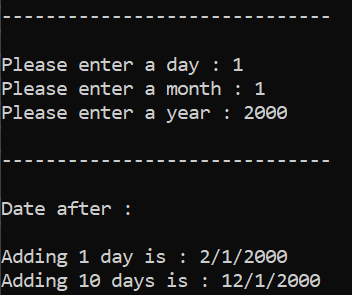

# Problem Solving in C++ - Level 4

Welcome to my C++ problem-solving repository! In this repository, I solve various algorithmic problems to enhance my programming skills in C++. Each problem is stored in its own directory, and this README will describe each of the exercises.

## Exercise 1: Convert Number To Word Representation

### Problem Statement:

The task is to converts a given integer (0 to 999,999,999,999) into its English word representation. The program should handle large numbers with proper formatting, including "thousand", "million" and "billion"

### Output:

Below is an example of the program's output:

## Exercise 2: Leap Year Verification

### Problem Statement:

The task is to verify whether a given year is a leap year or not. A leap year is defined as a year that satisfies one of the following two conditions:

=> The year is divisible by 400, or

=> The year is divisible by 4 but not divisible by 100.

### Output:

Below is an example of the program's output:

## Exercise 3: Leap Year Verification Code Optimization

### Problem Statement:

The task is to optimize the code from the previous exercise into a single line of code.

### Output:

Below is an example of the program's output:

## Exercise 4: Convert Year To Time

### Problem Statement:

The task is to output the number of days, hours, minutes, and seconds in a given year based on whether it is a leap year or not.

### Output:

Below is an example of the program's output:

## Exercise 5: Convert Month To Time

### Problem Statement:

The task is to output the number of days, hours, minutes, and seconds for a given month in a specific year. If the month is 2 (February), it should check whether the year is a leap year to determine if February has 28 or 29 days. For all other months, it should return the correct number of days based on the month (e.g., 31 days for January, March, May, etc., and 30 days for April, June, September, November). Then, calculate the corresponding number of hours, minutes, and seconds for the given month.

### Output:

Below is an example of the program's output:

## Exercise 6: Convert Month To Time Code Optimization

### Problem Statement:

The task is to optimize the code from the previous exercise into a single line of code.

### Output:

Below is an example of the program's output:

## Exercise 7: Day of the Week Calculator

### Problem Statement:

calculates the day of the week for a given date (day, month, year). It takes user input for the date and then displays the corresponding day name (e.g., "Mon").

### Output:

Below is an example of the program's output:

## Exercise 8: Print Month Calendar

### Problem Statement:

The task is to print the calendar of a given month and year.

### Output:

Below is an example of the program's output:

## Exercise 9: Print Year Calendar

### Problem Statement:

The task is to print the calendar of a given year.

### Output:

Below is an example of the program's output:

## Exercise 10 : Days Of Beginning Of Year

### Problem Statement:

The task is to print the number of days that have passed in the year, given a specific month, day, and year.

### Output:

Below is an example of the program's output:

## Exercise 11 : Date From Day Of Day Order In A Year

### Problem Statement:

the task is to calculate from a given number of days and a specific year the exact date and return it in the format "day/month/year."

### Output:

Below is an example of the program's output:

## Exercise 12 : Add Days To Date

### Problem Statement:

The task is a date calculator that adds a specified number of days to a given date and outputs the resulting date.

### Output:

Below is an example of the program's output:

## Exercise 13 : compare Two Dates

### Problem Statement:

The task is to compare two given dates and determine which one is earlier, later, or if they are equal.

### Output:

Below is an example of the program's output:

## Exercise 14 : Check Two Dates Equality

### Problem Statement:

The task is to compare two given dates and determine whether they are equal or not.

### Output:

Below is an example of the program's output:

## Exercise 15 : Check if a Day is the Last of the Month and if the Month is the Last of the Year

### Problem Statement:

The task is to determine whether a given day is the last day of the specified month, and then check if that month is the last month of the year.

### Output:

Below is an example of the program's output:

## Exercise 16 : Add One Day To A Date

### Problem Statement:

The task is to add one day to a given date, taking into account whether it is the last day of the month. If it's the last day of the last month, the year should also be incremented. If it's the last day of any other month, the month should be updated. If it's not the last day of the month.

### Output:

Below is an example of the program's output:

## Exercise 17 : Calculate Difference Of Two Dates

### Problem Statement:

The task is to calculate the difference in days between two user-input dates, considering leap years and varying days in months.

### Output:

Below is an example of the program's output:

## Exercise 18 : Age Calculation in Days Based on User's Date of Birth

### Problem Statement:

The task is to compute the age in days of a person based on their date of birth, which will be input by the user. The program will calculate the number of days from the user's date of birth to the current date.

### Output:

Below is an example of the program's output:

## Exercise 19 : Date Difference Calculator with Date Swapping

### Problem Statement:

The task is to calculate the difference in days between two given dates with handling the swapping of dates when the first date provided is later than the second date. Additionally, the program must print the day difference as a negative number when the first date is later than the second.

### Output:

Below is an example of the program's output:

## Exercise 20 : Add X Days To A Date

### Problem Statement:

The task is to add a specified number of days to a given date, taking into account whether it is the last day of the month. If it's the last day of the last month, the year should also be incremented. If it's the last day of any other month, the month should be updated. If it's not the last day of the month.

### Output:

Below is an example of the program's output:

## Exercise 21 : Add One Week To A Date

### Problem Statement:

The task is to add one week to a given date, taking into account whether it is the last day of the month. If it's the last day of the last month, the year should also be incremented. If it's the last day of any other month, the month should be updated. If it's not the last day of the month.

### Output:

Below is an example of the program's output:

## Exercise 22 : Add X Weeks To A Date

### Problem Statement:

The task is to add a specified number of weeks to a given date, taking into account whether it is the last day of the month. If it's the last day of the last month, the year should also be incremented. If it's the last day of any other month, the month should be updated. If it's not the last day of the month.

### Output:

Below is an example of the program's output:

## Exercise 23 : Add One Month To A Date

### Problem Statement:

The task is to add one month to a given date.

### Output:

Below is an example of the program's output:

## Exercise 24 : Add X Months To A Date

### Problem Statement:

The task is to add a specified number of months to a given date.

### Output:

Below is an example of the program's output:

## Exercise 25 : Add One Year To A Date

### Problem Statement:

The task is to add one year to a given date.

### Output:

Below is an example of the program's output:

## Exercise 26 : Add X Years To A Date

### Problem Statement:

The task is to add a specified number of years to a given date.

### Output:

Below is an example of the program's output:

## Exercise 28 : Add One Decade To A Date

### Problem Statement:

The task is to add one decade to a given date.

### Output:

Below is an example of the program's output:

## Exercise 29 : Add One Decade To A Date

### Problem Statement:

The task is to add a specified number of decades to a given date.

### Output:

Below is an example of the program's output:

## Exercise 30 : Add One Century To A Date

### Problem Statement:

The task is to add one century to a given date.

### Output:

Below is an example of the program's output:

## Exercise 32 : Add One Millennium To A Date

### Problem Statement:

The task is to add one millennium to a given date.

### Output:

Below is an example of the program's output:

## Exercise 33 : Subtract One Day From A Date

### Problem Statement:

The task is to subtract one day from a given date.

### Output:

Below is an example of the program's output:

## Exercise 34 : Subtract X Days From A Date

### Problem Statement:

The task is to subtract a specified number of days from a given date.

### Output:

Below is an example of the program's output:

## Exercise 35 : Subtract One Week From A Date

### Problem Statement:

The task is to subtract one week from a given date.

### Output:

Below is an example of the program's output:

## Exercise 36 : Subtract X Weeks From A Date

### Problem Statement:

The task is to subtract a specifed number of weeks from a given date.

### Output:

Below is an example of the program's output:

## Exercise 37 : Subtract 1 Month From A Date

### Problem Statement:

The task is to subtract one month from a given date.

### Output:

Below is an example of the program's output:

